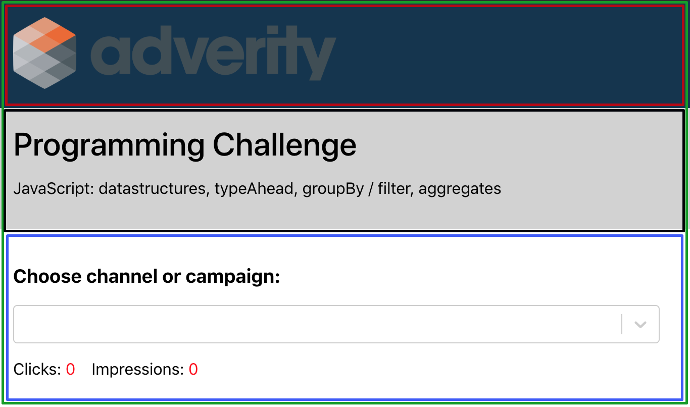

# Project description

## Components:

- ### Header
  ##### Stateless React component returns div element with company logo which is passed as a prop from App component.
- ### Title
  ##### Stateless component returns div element with title and description passed as a prop from App component.
- ### DisplayMetrics
  ##### A stateful component which receives parsed CSV data through props from the App component. After receiving parsed data it will be created suggestions for a select field which contains campaign and channel values from received data. Depending on user select choice it will be calculated the number of total clicks and impressions for selected channel or campaign. This is implemented in a calculateClicksAndImpressions method. In render, the component returns div element which contains a title, select element from react-select and two labels where is displayed current values for clicks and impressions.
- ### App
  ##### The App component is stateful and it is the main component which passes props to previous components and renders it. Axios get request is sent for getting data from a server. After receiving, data are parsed with Papa parser for CSV file format and passed as a prop to DisplayMetrics component.

